# API Reference

This document is automatically generated. Do not edit manually.

## Core Architecture Diagram

## `app.cli.ledger_cli`

::: app.cli.ledger_cli

## `app.cli.quarantine_cli`

::: app.cli.quarantine_cli

## `app.config`

::: app.config

## `app.core.analyzer`

::: app.core.analyzer

## `app.core.analyzer_strategies`

::: app.core.analyzer_strategies

## `app.core.cache`

::: app.core.cache

## `app.core.crypto`

::: app.core.crypto

## `app.core.daemon`

::: app.core.daemon

## `app.core.db`

::: app.core.db

## `app.core.db_conn`

::: app.core.db_conn

## `app.core.db_worker`

::: app.core.db_worker

## `app.core.diagram_schema`

::: app.core.diagram_schema

## `app.core.domain_contracts`

::: app.core.domain_contracts

## `app.core.downloader`

::: app.core.downloader

## `app.core.env_helper`

::: app.core.env_helper

## `app.core.exceptions`

::: app.core.exceptions

## `app.core.extractor`

::: app.core.extractor

## `app.core.extractor_strategies`

::: app.core.extractor_strategies

## `app.core.file_renamer`

::: app.core.file_renamer

## `app.core.forensic_scanner`

::: app.core.forensic_scanner

## `app.core.hashes_registry`

::: app.core.hashes_registry

## `app.core.history`

::: app.core.history

## `app.core.integration`

::: app.core.integration

## `app.core.ipc`

::: app.core.ipc

## `app.core.jev_classifier`

::: app.core.jev_classifier

## `app.core.ledger`

::: app.core.ledger

## `app.core.link_manager`

::: app.core.link_manager

## `app.core.metadata`

::: app.core.metadata

## `app.core.mover`

::: app.core.mover

## `app.core.offline_loader`

::: app.core.offline_loader

## `app.core.path_utils`

::: app.core.path_utils

## `app.core.plugin_registry`

::: app.core.plugin_registry

## `app.core.policy_engine`

::: app.core.policy_engine

## `app.core.progress`

::: app.core.progress

## `app.core.quarantine_interceptor`

::: app.core.quarantine_interceptor

## `app.core.resilient_file_ops`

::: app.core.resilient_file_ops

## `app.core.scanner`

::: app.core.scanner

## `app.core.security`

::: app.core.security

## `app.core.semantic_embeddings`

::: app.core.semantic_embeddings

## `app.core.session`

::: app.core.session

## `app.core.shared_registry`

::: app.core.shared_registry

## `app.core.simulation_exporter`

::: app.core.simulation_exporter

## `app.core.text_utils`

::: app.core.text_utils

## `app.core.user_space_bootstrap`

::: app.core.user_space_bootstrap

## `app.core.verifier`

::: app.core.verifier

## `app.demo`

::: app.demo

## `app.log_filter`

::: app.log_filter

## `app.main`

::: app.main

## `app.plugins.clinical_compliance.clinical_compliance`

::: app.plugins.clinical_compliance.clinical_compliance

## `app.plugins.clinical_compliance.clinical_renamer`

::: app.plugins.clinical_compliance.clinical_renamer

## `app.plugins.clinical_compliance.clinical_strategy`

::: app.plugins.clinical_compliance.clinical_strategy

## `app.plugins.clinical_compliance.clinical_taxonomy`

::: app.plugins.clinical_compliance.clinical_taxonomy

## `app.plugins.clinical_compliance.cro_multi_study_pipeline`

::: app.plugins.clinical_compliance.cro_multi_study_pipeline

## `app.plugins.clinical_compliance.plugin`

::: app.plugins.clinical_compliance.plugin

## `app.plugins.clinical_compliance.study_disambiguator`

::: app.plugins.clinical_compliance.study_disambiguator

## `app.plugins.clinical_compliance.tui_views`

::: app.plugins.clinical_compliance.tui_views

