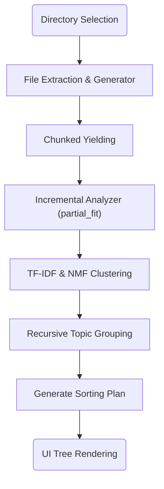
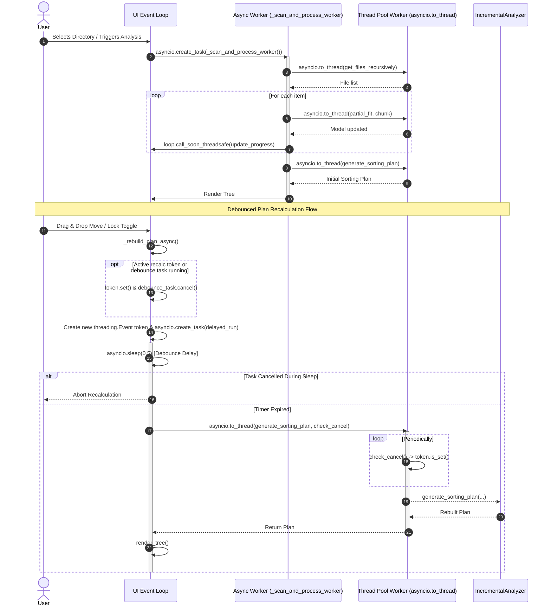

# Architecture & Internals

## Data Flow: Directory Selection to Sorting Plan

The system relies on an automated, pipelined data flow from the moment the user selects a directory to the generation of the final sorting plan.

### 1. Data Extraction
When a directory is selected, `build_corpus_generator` scans and extracts text from supported files (PDFs, DOCX, CSV, Excel, TXT).

### 2. ML Clustering & Recursive Analysis

See [IncrementalAnalyzer][app.core.analyzer.IncrementalAnalyzer] for details on the core incremental ingestion logic.

See [RecursiveKMeansStrategy][app.core.analyzer_strategies.RecursiveKMeansStrategy] for details on the hierarchical clustering approach used for deep folder structures.

### 3. Folder Naming Logic
Folder names are generated dynamically using NMF components. The folder naming logic selects the top 2 terms for each topic and concatenates them with a hyphen (e.g., `Finance-Money`). Words are capitalized based on a TF-IDF vectorizer of the cluster documents.

## Asyncio Concurrency & UI Responsiveness

The application features a responsive user interface powered by an `asyncio` event loop and leverages thread pool offloading to ensure non-blocking UI interactions during heavy file I/O and machine learning operations.

- **Async Event Loop & Non-Blocking Scheduling:** Long-running background operations, such as initial directory processing (`_scan_and_process_worker`), are scheduled on the active `asyncio` event loop using `asyncio.create_task`.
- **Thread Pool Offloading (`asyncio.to_thread`):** Blocking file system scanning (`get_files_recursively`), document metadata extraction (`MetadataPass.run`), incremental ML fitting (`partial_fit`), and sorting plan calculation (`generate_sorting_plan`) are delegated to worker threads via `asyncio.to_thread` to keep the UI event loop unblocked.
- **Debounced Plan Recalculation:** User actions that require plan updates (such as file drag-and-drop moves or node lock toggles) trigger `_rebuild_plan_async`. Recalculation is debounced by 0.5 seconds using `asyncio.sleep(0.5)` wrapped inside a `_debounce_task`. Rapid user interactions cancel any existing pending debounce task (`_debounce_task.cancel()`) to prevent redundant plan recalculations.
- **Cooperative Token Cancellation (`threading.Event`):** Plan recalculations utilize isolated `threading.Event` cancellation tokens (`_current_recalc_token`). The offloaded thread regularly evaluates a `check_cancel` callback (`lambda: token.is_set()`). If the token is set or if `asyncio.sleep` raises `asyncio.CancelledError`, background execution aborts immediately, preventing wasteful CPU and RAM consumption.
- **Thread-Safe UI Dispatch:** Thread worker progress callbacks dispatch UI component updates back to the primary asyncio event loop using `loop.call_soon_threadsafe`.

### Background Processing & Debouncing Sequence Flow

## Centralized System Utilities & Architectural Guardrails

To prevent redundant patterns, platform-specific path bugs, and visual/functional defects across application scopes, we consolidate all system packaging checks, path character validations, and database directory setups / encryption key lookups.

### Centralized Core Helpers
All shared system utilities must reside in or be exposed through `app.core.path_utils`. Direct usage of custom platform or frozen bundle hacks is strictly prohibited.
* **Packaging and Bundle Detections:** The unified helper `is_packaged()` in `app.core.path_utils` checks `sys.frozen` to detect if the app is running in a PyInstaller frozen bundle.
* **Path Sanitization & Name Validation:** Standard validations such as `validate_target_path()`, `sanitize_name()`, and `is_valid_name()` standardize path checking across the application, adhering to OS limits and avoiding platform-specific path errors.
* **Session and Data Directory Resolution:** Session setup is centralized in `setup_session_directory()` and encryption key lookup is handled via `resolve_db_crypto()`.

### Automated Commit-Stage Linting
The automated validation script `scripts/validate_duplicates.py` is configured as a pre-commit hook to parse Python files and reject any attempts to re-introduce hardcoded path characters (e.g., `<>:"|?*`), direct `sys.frozen` checks, or raw `secret.key` references outside of `path_utils.py`. This keeps pre-commit validation times extremely low (typically < 0.5s) while enforcing strong guardrails against duplicate utilities.

