# Troubleshooting Guide

Welcome to the Smart AutoSorter AI Pro troubleshooting guide. If you are experiencing issues during setup, particularly with downloading the AI model, please consult the sections below.



## Common Network Failure Messages

### 1. "Download failed: Cannot connect to host" or "Connection timeout"
**Cause:** Your firewall, antivirus, or network proxy is blocking the background network request to Hugging Face (`huggingface.co`), or you are completely disconnected from the internet.
**Solution:**
- Check your internet connection.
- Temporarily disable your VPN or firewall to see if it allows the download to proceed.
- If you are on an enterprise network, you may need to ask your administrator for an **offline deployment bundle** to sideload the model.

### 2. "Download failed: Insufficient disk space"
**Cause:** The 80MB AI model download requires free disk space on your local drive.
**Solution:**
- Free up at least 200MB of space on your main system drive.
- Clear unneeded temporary files on your drive, then retry the download.

## Manual Retries

If the initial download in the Setup Wizard fails or if you previously declined AI consent, you can manually trigger consent setup or retry the AI model download at any time:

### Using CLI Commands
- Grant consent and trigger model setup directly from the command line:
  ```bash
  python app/main.py --accept-ai-consent
  ```
- Alternatively, update your stored configuration setting directly:
  ```bash
  python app/main.py config --set AI_CONSENT_GRANTED true
  ```
- In non-interactive or headless execution environments without a TTY, include non-interactive flags to bypass interactive dialog prompts:
  ```bash
  python app/main.py --accept-ai-consent --skip-wizard --non-interactive
  ```

### Using Text User Interface (TUI)
- Launch the interactive terminal interface:
  ```bash
  python app/main.py --tui
  ```
- Press `[Ctrl+W]` to reopen the Model Onboarding Wizard modal.
- Use `[Tab]` to navigate to the **AI Consent Granted** toggle switch, press `[Space]` or `[Enter]` to toggle consent on, and press `[Enter]` on **Finish & Save** to save your preferences and retry initialization.

If the problem persists and you cannot resolve your network issues, you can continue using the application in **Offline Non-Semantic Mode** (`python app/main.py --decline-ai-consent`), which will still process your files automatically, albeit without advanced AI context.
