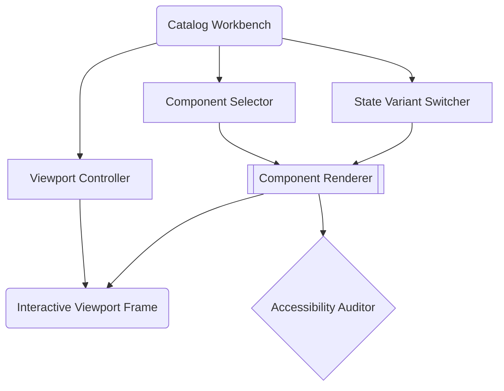
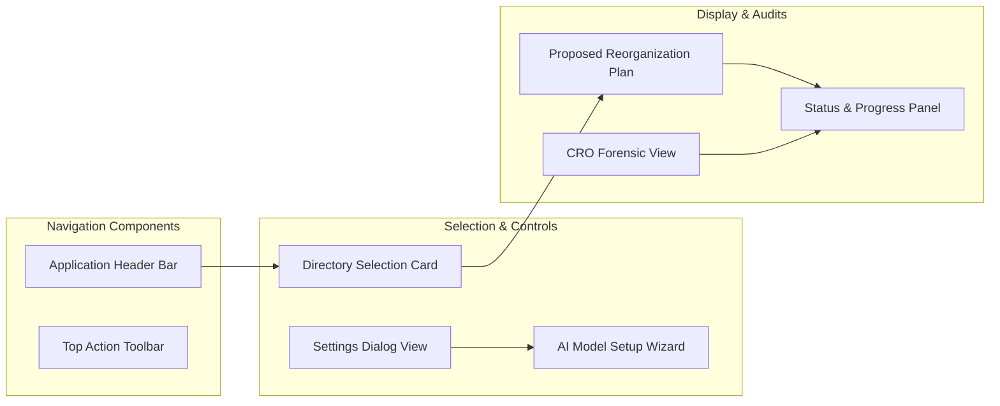

# UI API Reference

This document is automatically generated. Do not edit manually.

## Component Architecture & Catalog Diagrams

### Catalog Interactive Workbench Workflow

### UI Component Hierarchy

## `app.ui.a11y_runner`

::: app.ui.a11y_runner

## `app.ui.app`

::: app.ui.app

## `app.ui.catalog`

::: app.ui.catalog

## `app.ui.cro_forensic_view`

::: app.ui.cro_forensic_view

## `app.ui.diagram_schema`

::: app.ui.diagram_schema

## `app.ui.dialog_helper`

::: app.ui.dialog_helper

## `app.ui.help_modal`

::: app.ui.help_modal

## `app.ui.settings`

::: app.ui.settings

## `app.ui.tokens`

::: app.ui.tokens

## `app.ui.toolbar`

::: app.ui.toolbar

## `app.ui.tui`

::: app.ui.tui

## `app.ui.wizard`

::: app.ui.wizard

